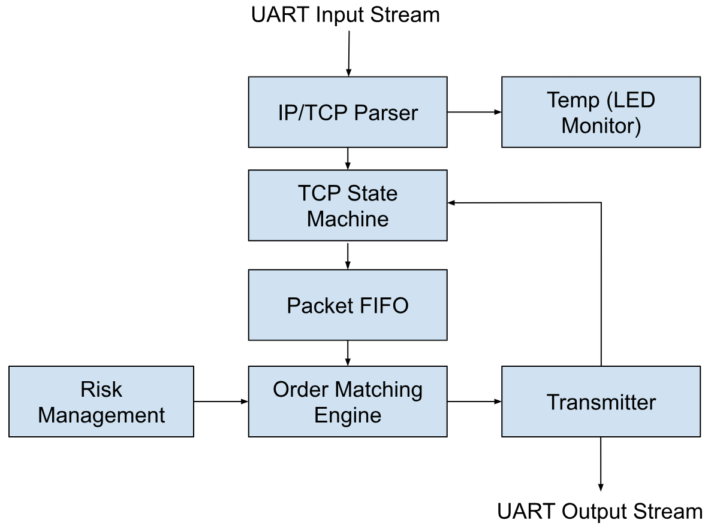

# FPGA Trading System

A high-frequency trading (HFT) system implemented on an FPGA (Basys 3), designed to simulate real-world electronic trading under ultra-low latency constraints. This project emulates network packet flows, order matching, and risk control using Verilog-based hardware logic and UART communication. Along with the main modules, the project includes dedicated testbenches for each file to verify functionality, ensure correctness, and simulate realistic trading scenarios before deployment to hardware.


## Key Features

- TCP-like Packet Parsing
- Price-Time Priority Matching Engine
- Risk Management Controls
- UART I/O for Trade Transmission
- Modular & Testable Verilog Architecture

## System Architecture

<p align="center">
  
</p>

## Project Structure

```text
hft_fpga_system/
├── hft_fpga_system.srcs/
│   ├── sources_1/
│   │   └── new/
│   │       ├── order_matching_engine.v
│   │       ├── tcp_ip_stack.v
│   │       ├── ethernet_layer.v
│   │       ├── ip_layer.v
│   │       ├── tcp_layer.v
│   │       ├── custom_ip_core.v
│   │       ├── axi_stream_if.v
│   │       ├── risk_management.v
│   │       └── top_level.v
│   ├── constrs_1/
│   │   └── new/
│   │       └── Constraints.xdc
│   └── sim_1/
│       └── new/
│           ├── tb_order_matching_engine.v
│           ├── tb_tcp_ip_stack.v
│           ├── tb_custom_ip_core.v
│           ├── tb_risk_management.v
│           └── tb_top_level.v
├── hft_fpga_system.xpr
```

## Project Overview

### `Wrapper.v`
This is the top-level module. It connects all the other submodules and wires them to the FPGA I/O. It Provides system-wide control signals (e.g., `RESET`, `CLK`) and binds UART lines, debug LEDs, and flow control between logic blocks.

---

### `uart_receiver.v`
This module receives serialised packet data over UART at a 9600 baud rate. It extracts TCP/IP-like fields including sequence numbers, flags, payload length, and order content. It also checks for a hardcoded destination IP to simulate a valid connection.

---

### `tcp_state_machine.v`
Implements a basic TCP handshake/connection tracker. It monitors sequence/acknowledgement numbers and flags (SYN, ACK, etc.), simulating state transitions like `LISTEN → SYN_RCVD → ESTABLISHED`. Outputs a clean, parsed payload and ready signal.

---

### `packet_fifo.v`
A buffer module that queues incoming payloads parsed by the TCP state machine. Decouples the receiver from the core trading logic to ensure flow control and prevent data loss under high loads.

---

### `order_matching_engine.v`
The heart of the system. Maintains a price-time priority order book using parallel arrays for bids and asks. On receiving a packet, it either:
- Cancels an existing order
- Scans for a matching order to trade against
- Inserts a new order into the book

It then generates a `trade_valid` pulse with order details upon a successful match.

---

### `risk_management.v`
Intercepts trades from the matching engine. Ensures no trade violates position or exposure limits using parameterised thresholds. Trades that pass are approved and passed forward for transmission.

---

### `uart_transmitter.v`
Serialises and sends approved trades over UART. Sends back trade details like price, quantity, and participant IDs to an external system (e.g., computer or logger).

---

### `debouncer.v`
Stabilizes button inputs (like BTNR) used to manually trigger trade transmission. Prevents multiple triggers from switch bouncing.

---

### `temp.v`
A lightweight monitor that lights up status LEDs when packets are received and parsed correctly. Useful for debugging and visual confirmation that packets are being received.

## Technologies

- Verilog HDL
- Xilinx Vivado
- Basys 3 FPGA (Artix-7)
- UART Protocol
- RTL Design

## Future Improvements

- AXI4-Stream Integration 
  Move to AXI4-Stream interfaces for better compatibility with DMA engines and high-speed IP cores, enhancing throughput and modularity.

- Dynamic Risk Configuration  
  Allow runtime adjustment of risk parameters (e.g., max position/exposure limits) via UART or control register interface for more flexible testing and prototyping.

- Real-Time Monitoring Interface  
  Add a UART or VGA dashboard module to view internal book state, trades executed, or performance metrics in real time.

- Sub-Nanosecond Latency Profiling  
  Use on-chip timers to measure exact cycle latencies through each module and identify performance bottlenecks.

- Configurable FIFO Depths  
  Parameterize all FIFO buffers to allow tuning for throughput vs. resource trade-offs based on target FPGA.

- Add Replay or Logging Capability  
  Store incoming/outgoing packets for replay or post-analysis, would be useful for debugging and stress testing.

- Integration with Software Back-Ends  
  Connect the FPGA output to a software trading simulator or order book visualizer via serial/USB to bridge hardware and higher-level analytics.

- Full TCP/IP Stack over Ethernet  
  Replace UART simulation with actual Ethernet MAC + PHY IP to support real network interfaces, enabling compatibility with financial data feeds and exchange simulators. This would however require me to get a new FPGA and the reason for this not being done in the first place was that the Basys 3 board does not have an ethernet port.

## Contributing

Contributions to this FPGA Trading System are welcome! If you find any issues or have suggestions for improvements, please open an issue or submit a pull request. 


